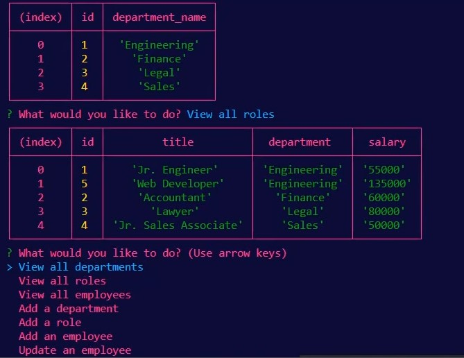

# 12-Module-Challenge
### SQL Challenge: Employee Tracker

---

## Employee Tracker

The [Employee Tracker](https://watch.screencastify.com/v/yagvUntkjU6txHw2Fv3j) is an efficient way to manage employees, roles, and department information within the comapany, you are able to create new roles and view the salry for certain roles or assign new roles to employees

---

## Instructions [(Walk Through Video)](https://watch.screencastify.com/v/yagvUntkjU6txHw2Fv3j) 

1. Clone down the repository
```
git clone git@github.com:Josejpd3/12-Module-Challenge.git
```
2. Enter in to **12-Module-Challenge** repo
```
cd 12-Module-Challenge
```
3. Install dependencies
```
npm i
```
4. Run the application
```
node index.js
```


After completing these steps the application will start and display several options.


